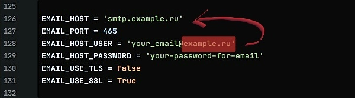

# blogTestProject
Проект "blogTestProject" с возможностью создания постов в своем блоге и просмотре постов в блогах других пользователей

---

# ЗАПУСК ПРОЕКТА
Запустить данный проект можно двумя способами: либо через "Dockerfile", либо через "manage.py"

---

## ОБЯЗАТЕЛЬНЫЙ ПУКНТ

Для начала скачайте проект с git, разархивируйте его и откройте.

Далее откройте файл "settings.py" и измените значение EMAIL_HOST, EMAIL_HOST_USER и EMAIL_HOST_PASSWORD как показано на картинке ниже:

EMAIL_HOST - 'smtp.<все после @ в вашей почте>'

EMAIL_HOST_USER - электронная почта, с которой будут отправляться сообщения (уведомления) пользователям

EMAIL_HOST_PASSWORD - пароль от вышеуказанной почты

---

## ЗАПУСК ПРОЕКТА ЧЕРЕЗ "Dockerfile"

Запустите Docker на вашем компьютере и введи последовательно все нижеперечисленные команды:

`python3 manage.py migrate`

`pip install -r requirements.txt`

`docker build -t blog-test-project -f Dockerfile .`

`gunicorn blogTestProject.wsgi:application —bind localhost:8000`

Проект запущен.

---

## ЗАПУСК ПРОЕКТА ЧЕРЕЗ "manage.py"

Введи последовательно все нижеперечисленные команды:

`virtualenv myVenv`

`source myVenv/bin/activate`

`pip install -r requirements.txt`

`python3 manage.py migrate`

`python3 manage.py runserver`

Проект запущен.

---

## СОЗДАНИЕ СУПЕРЮЗЕРА ДЛЯ ДОСТУПА К АДМИНИСТРАТИВНОЙ ПАНЕЛИ DJANGO

После ввода нижепредставленной команды нужно вести логин, почту и пароль дважды:

`python3 manage.py createsuperuser`

Админка доступна по url: http://127.0.0.1:8000/admin/

